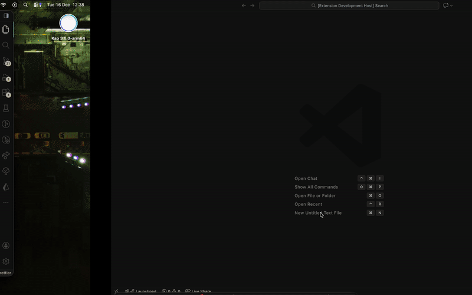
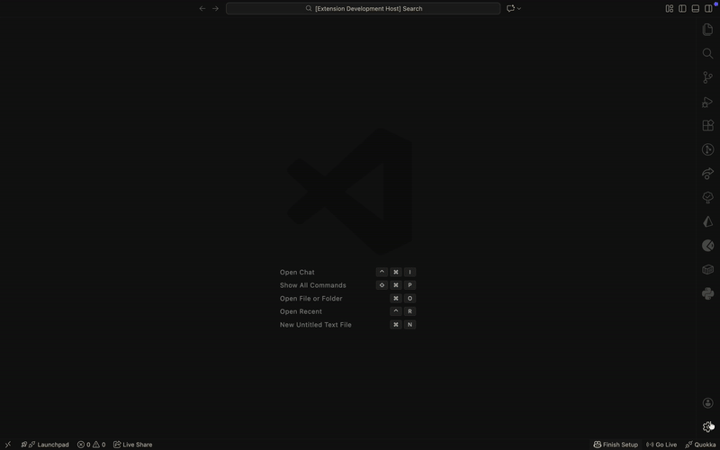

# CodeWord README

CodeWord is a VS Code extension that brings Scripture reading and meditation into your development workflow. It allows you to schedule daily Bible passages or meditate on selected verses without leaving your coding environment. The extension respects your focus, opens passages in a clean split view, and supports both offline and reading-plan modes.

## Features

CodeWord offers the following key features:

- Offline Bible Support
  Reads from a bundled JSON file; no internet connection required.
- Manual Command: CodeWord: Unsheath
  Opens a picker to select book, chapter, and verse manually.

  

- New Editor Column
  Read Scripture alongside your development work without disruption.
- Meditation Mode
  Automatically opens selected Bible passages at configured times for reflection and devotion.
- Reading Plan Mode
  Follow structured Bible reading plans, with passages opening in a split view alongside your code.
- Multiple Daily Times
  Configure several reading or meditation times per day.

  

## Requirements

- VS Code 1.102.1 or later
- No external dependencies required; works offline
- Optional: Configure your Bible times and reading plan in settings

## Extension Settings

This extension contributes the following settings:

- bible.mode — Choose the mode for CodeWord (Meditation or Reading Plan).
- bible.meditation.books — List of passages for meditation mode.
- bible.times — Times of day (HH:MM) to show Bible readings.

## Known Issues

- The extension activates only when VS Code starts or a command is run. Scheduled meditation does not run if VS Code is closed.
- Webview panels currently do not support custom icons in VS Code.

## Release Notes

Users appreciate release notes as you update your extension.

### 1.0.0

- Initial release of CodeWord: Unsheath
- Meditation mode with scheduled passages
- Reading plan mode with configurable book and chapters
- Manual command CodeWord: Unsheath to pick book, chapter, and verse
- Offline Bible support in JSON format

---

**Enjoy!**
